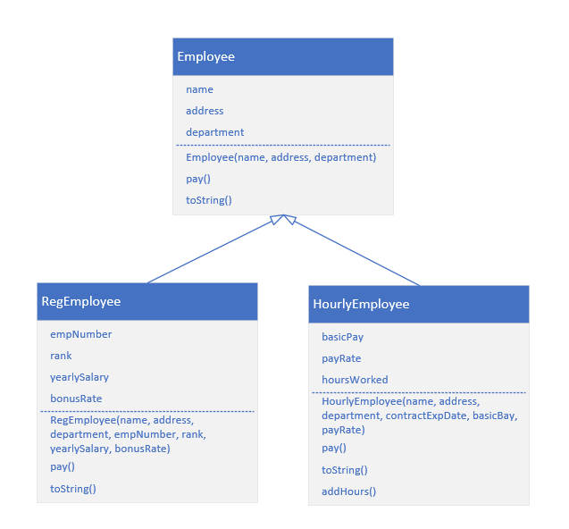

# 4주차 과제
## 직원 관리 프로그램 (100점)
직원별로 급여를 계산해주는 프로그램을 만들어야한다.
클래스 설계, 상속을 통한 다형성에 대한 이해를 위한 실습이다.  
 
크게 Employee, RegEmployee, HourlyEmployee 클래스로 구성된다.  
Employee 클래스는 추상 클래스로 이름, 주소, 부서 필드를 가진다.  
메소드로 급여를 계산하는 추상메소드 pay와 정보를 출력하는 toString을 가진다.  
모든 필드를 인자로 받아 초기화하는 생성자 하나는 필수적으로 만들어야한다.  
 

   
RegEmployee 클래스는 Employee 클래스를 상속 받아 
직원 번호, 직급, 연봉, 보너스율 필드를 추가로 가진다.  
메소드는 Employee 클래스의 메소드를 적절하게 override 해야한다.  
 
HourlyEmployee 클래스도 Employee 클래스를 상속 받는다.  
시간제 직원은 기본 임금, 시간당 임금, 근무 시간 필드를 추가로 가진다.  
RegEmployee 클래스처럼 Employee 클래스 메소드를 override 해야한다.  
추가적으로 addHours 메소드가 추가되는데 시간제 직원의 근무 시간을 추가하는 메소드이다.  
 
아래는 채점 항목표이다.

| 4주차          |     항목    | 배점 | 점수 |
|:---------------|:-----------|:----:|:----:|
|    Employee    | 추상 클래스 |   10 |   10 |
|                | 필드        |    5 |    5 |
|                | 생성자      |    5 |    5 |
|                | pay         |    5 |    5 |
|                | toString    |    5 |    5 |
|   RegEmployee  | 상속        |   10 |   10 |
|                | 필드        |    5 |    5 |
|                | 생성자      |    5 |    5 |
|                | pay         |    5 |    5 |
|                | toString    |    5 |    5 |
| HourlyEmployee | 상속        |   10 |   10 |
|                | 필드        |    5 |    5 |
|                | 생성자      |    5 |    5 |
|                | pay         |    5 |    5 |
|                | toString    |    5 |    5 |
|                | addHours    |    5 |    5 |
| EmployeeDriver | 실행 확인   |    5 |    5 |
|      기타      | -          |   - |   - |
  
3주차처럼 세세하게 항목을 나누었는데 다들 잘 수행해줘서 쓰임새가 크지는 않았다. 
 
Employee 클래스를 추상 클래스로 만들고 pay 메소드를 추상메소드로 만드는 것은 
제출한 학생 모두가 잘 수행하였다. RegEmployee 클래스와 HourlyEmployee 클래스에서 
상속도 잘 수행하였고 헷갈려 할 줄 알았던 pay와 toString 메소드를 override하는 것도 
다들 잘 수행해주어 대견했다.  
HourlyEmployee 클래스 생성자에 작은 함정?이 있는데 조건에서 사용되지 않는 contractExpDate(계약만료일)를 
인자로 요구하고 있다. contractExpDate 필드는 필수 조건으로 명시되지 않고 있고 용도도 나와 있지 않기에 
어떻게 처리해야할지 생각하게 만드는 요소이다. 아무래도 필요성이 없다보니 
대부분의 학생들은 생성자의 매개변수로 받아 아예 사용하지 않는 형식으로 구현했다. 
심한 경우에는 제시된 생성자 조건을 간과하고 생성자를 임의로 다른 형태로 바꾸거나 테스트 코드(EmployeeDriver class)를 수정해버린 학생도 있었다. 
일부 학생이 계약만료일 필드를 추가로 만들어 해당 필드를 생성자에서 초기화했지만 
계약만료일을 출력하도록 구현한 사람은 한 명도 없었다. 이 점이 조금 아쉬웠다.

[전체목록으로 돌아가기](./../../../)